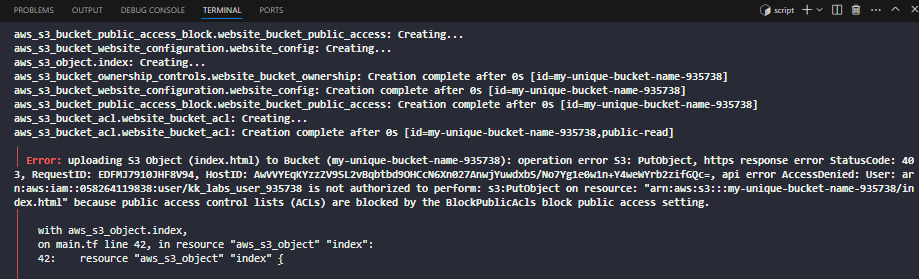

Saya membuat website statis di AWS S3 menggunakan Terraform di KodeKloud Playground (akun: kk_labs_user_935738). Saya menghadapi error 403 karena ACL publik diblokir, tetapi saya memperbaikinya dengan menggunakan bucket policy untuk akses publik. Saya mengikuti workflow Terraform: write, plan, apply, dan menghasilkan website yang dapat diakses melalui URL publik

Menghadapi dan Mengatasi Error

Deskripsi Error

Saat menjalankan terraform apply, saya menghadapi error berikut:

Error ini terjadi saat Terraform mencoba mengunggah file index.html ke bucket S3 dengan ACL public-read.

Penyebab Error

BlockPublicAcls: Pengaturan BlockPublicAcls di bucket atau akun AWS memblokir penggunaan ACL publik (public-read), yang menyebabkan operasi s3:PutObject gagal.

Izin Pengguna: Akun sementara KodeKloud (kk_labs_user_935738) mungkin memiliki kebijakan IAM yang membatasi penggunaan ACL publik.

Urutan Penerapan: Terraform mungkin menerapkan aws_s3_object sebelum pengaturan block_public_acls = false sepenuhnya aktif.

Proses Troubleshooting

Analisis Error:

Pesan error menunjukkan bahwa BlockPublicAcls mencegah penggunaan ACL public-read pada aws_s3_object.

Saya memeriksa kode main.tf dan menemukan bahwa resource aws_s3_bucket_acl menggunakan acl = "public-read", yang bertentangan dengan pengaturan BlockPublicAcls.

Penelitian Solusi:

Saya mengetahui bahwa AWS merekomendasikan penggunaan bucket policy alih-alih ACL untuk akses publik, terutama pada akun dengan pengaturan keamanan ketat.

KodeKloud Playground mungkin memiliki batasan tambahan pada akun sementara, sehingga ACL publik tidak diizinkan.

Perubahan Kode:

Menghapus resource aws_s3_bucket_acl dan atribut acl = "public-read" dari aws_s3_object.

Menambahkan aws_s3_bucket_policy untuk mengizinkan akses publik (s3:GetObject) ke objek di bucket.

Verifikasi:

Menjalankan terraform destroy untuk menghapus infrastruktur lama.

Menjalankan terraform apply dengan kode baru.

Mengakses website di http://my-unique-bucket-name-935738.s3-website-us-east-1.amazonaws.com untuk memastikan berhasil.

Hasil Troubleshooting

Website berhasil di-deploy tanpa error.

Bucket policy memungkinkan akses publik tanpa bergantung pada ACL.